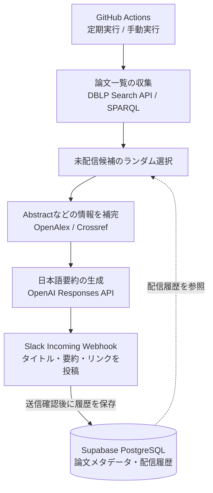

# HCI Paper Recommendation Bot

**HCIの論文を毎日1本、日本語要約とともにSlackへ届けるBot。**

[](https://github.com/a-UuU-a/hci-paper-bot/actions/workflows/test.yml)


HCI（Human–Computer Interaction：人とコンピュータの関わりを研究する分野）の論文に、日常的に触れるきっかけを作るためのアプリケーションです。複数の国際会議から未配信の論文をランダムに選び、研究の概要と原論文へのリンクをSlackに投稿します。

論文の収集・選択・要約・配信・履歴保存をPythonのバッチ処理として実装しています。GitHub Actionsで定期実行するため、常時稼働するWebサーバーは不要です。

## 主な機能

- **8つの国際会議に対応**：CHI / UIST / DIS / CSCW / TEI / IUI / ISMAR / IEEE VR。対象は設定ファイルで変更できます。
- **最近の研究から毎日1本を紹介**：当年を含む5暦年の論文が対象。初期設定では毎朝07:00 JST頃に実行します。
- **日本語で概要を把握**：Abstract（論文の概要）から最大180文字の要約を生成し、タイトル・著者・学会・発表年・リンクとともに投稿します。
- **配信履歴を保存**：配信済みの論文を次回の候補から除外します。メタデータはSupabase PostgreSQLに保存し、再利用します。
- **投稿前にプレビュー**：SlackやDBに接続せず、ターミナルで表示を確認できる`--dry-run`を用意しています。

## 投稿イメージ

同梱の[デモデータ](examples/papers.json)による表示例です。架空の論文で、以下の本文はLLMによる生成ではなく、日本語Abstractの原文抜粋です。

```text
📄 Example: Exploring Tactile Feedback in Virtual Reality

👤 Alice Example, Bob Example, Carol Example, et al.
🏛 CHI 2025

📝 日本語要約
VR環境における触覚フィードバックの設計を検討するため、試作システムを開発した。参加者による操作課題とインタビューを通じて、提示方法ごとの使いやすさと体験の違いを比較し、設計上の課題を整理した。

🔗 https://example.org/demo-paper

🏷 Virtual Reality · Haptics · Interaction
```

## APIキーなしで試す

Python 3.12以上と[uv](https://docs.astral.sh/uv/getting-started/installation/)を用意し、リポジトリを取得して実行します。

```bash
git clone https://github.com/a-UuU-a/hci-paper-bot.git
cd hci-paper-bot
uv sync --frozen
uv run python -m src.main --dry-run --no-llm --fixture examples/papers.json --year 2025
```

外部APIへの通信・課金・Slack投稿・DB保存を行わず、上のデモをターミナルに表示します。通常の`--dry-run`では実際の論文を取得し、OpenAI APIを利用します。

実際の配信には`DATABASE_URL`・`SLACK_WEBHOOK_URL`・`OPENAI_API_KEY`を設定します。接続情報の準備、プレビュー、DB初期化、GitHub Actionsへの登録は[セットアップと運用ガイド](docs/operations.md)を参照してください。

## システム構成



候補を順に調べ、必要な情報と要約が揃った論文を配信します。Abstractが見つからない場合や要約に失敗した場合は、次の候補を試します。

| 技術 | 役割 |
| --- | --- |
| Python 3.12+ / uv | バッチ処理、依存関係・実行環境の管理 |
| httpx / Pydantic | HTTP通信、設定と取得データの検証 |
| DBLP / OpenAlex / Crossref | 書誌情報、Abstract、Topicなどの取得・補完 |
| OpenAI Responses API | Abstractに基づく日本語要約。初期モデルは`gpt-4.1-mini` |
| SQLAlchemy / Alembic / Supabase PostgreSQL | ORMによる永続化、DBスキーマの更新、配信履歴管理 |
| Slack Incoming Webhook / GitHub Actions | 通知、定期・手動実行、CI |
| pytest / Ruff | 自動テスト、静的解析、フォーマット |

## 設計上の工夫

### 論文の同一性を確認し、重複配信を抑える

DOI（論文を識別するためのID）を正規化し、DOIがない場合はタイトル・発表年・筆頭著者から安定したIDを生成します。後からDOIが判明した場合も同一論文として照合し、配信履歴を引き継ぎます。タイトル検索で取得したメタデータも、年と著者を確認してから取り込みます。[正規化・照合の実装](src/services/normalization.py)

### 外部APIの障害に対応する

HTTP 429・5xx・通信エラーは待ち時間を増やして再試行し、`Retry-After`も尊重します。DBLPの検索APIが利用できない場合は公式SPARQL APIに切り替えます。OpenAlex・Crossrefで情報を補完できない候補はスキップします。[HTTP処理](src/http.py) / [DBLPの取得処理](src/collectors/dblp.py)

### 必要な候補だけを補完する

取得済みのAbstractなどをDBに保持し、未配信候補から必要な分だけ追加情報を取得します。1回の実行で調べる候補は初期設定で最大50件とし、追加情報の取得が際限なく続かないようにしています。[配信処理](src/bot.py)

### 送信結果とDB保存を分けて扱う

SlackからHTTP 200と`ok`の応答を受けた後に成功履歴を保存します。DBへの書き込みではトランザクションとupsertを使い、履歴保存の再試行では同じUUIDを利用します。SlackとDBの間で生じる失敗についてもテストしています。[ORMの実装](src/database/orm.py) / [配信順序・失敗時のテスト](tests/test_bot.py)

### 責務を分離し、実サービスなしで検証する

収集・選択・要約・通知・永続化をモジュールに分け、要約やDBアクセスには差し替え用のインターフェースを定義しています。外部APIをモックしたテストと、SQLite・PostgreSQLを使う結合テストで検証します。接続情報は環境変数で受け取り、HTTP・DBの詳細ログを抑制し、エラーは機密情報を含まないメッセージに変換します。

## テストとCI

```bash
uv run ruff check .
uv run ruff format --check .
uv run pytest
```

[CI](.github/workflows/test.yml)ではpush・Pull Requestごとに上記のチェックとオフラインデモを実行し、テスト専用のPostgreSQL 16でORM・マイグレーションも検証します。本番用のSecretsや実サービスへの投稿・課金は使いません。ローカルでは`TEST_DATABASE_URL`が未設定の場合、PostgreSQLのテストのみスキップします。

主な検証対象は、学会・年度フィルタ、論文IDと同一性、APIのページング・再試行・SPARQLへの切り替え、要約の文字数、Slackの表示・送信確認、DBのロールバック、再試行時の履歴重複、CLI全体の処理です。

## ディレクトリ構成

```text
src/
├── collectors/      # DBLP・OpenAlex・Crossrefとの連携
├── services/        # 正規化、同一論文の照合、メタデータ補完
├── recommender/     # フィルタ・選択・スコアの拡張用インターフェース
├── summarizer/      # LLM要約・原文抜粋
├── notification/    # Slackへの投稿
├── database/        # ORMモデル、永続化、接続確認
├── bot.py           # 配信処理の組み立て
└── main.py          # CLI
config/              # 対象学会・配信条件
migrations/          # Alembicによるスキーマ管理
tests/               # 単体・結合テスト
examples/            # オフラインデモ用データ
.github/workflows/   # 定期配信・CI
docs/                # セットアップと運用ガイド
```

## 制約と今後の拡張

Slack WebhookとDBをまたぐトランザクションはないため、送信成功後のDB保存失敗や応答を受信できなかった場合には、再実行で重複投稿が発生する可能性があります。また、配信対象は外部APIからAbstractを取得できる論文に限られ、要約は原論文を読むための補助として利用します。

現在の選択方式はランダムです。今後の拡張候補は、キーワードやEmbeddingに基づく個人化推薦、Slackのフィードバック、設定用Web UIです。これらは未実装です。

運用上の詳細、設定項目、障害時の対応、API資料は[セットアップと運用ガイド](docs/operations.md)にまとめています。[実装仕様書](hci_paper_recommendation_bot_spec.md)には当初の要件と拡張案を記載しています。
